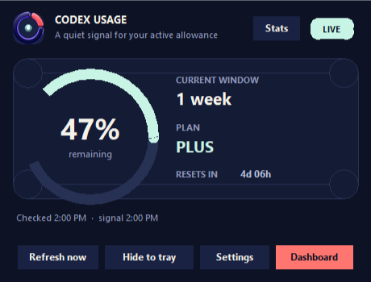
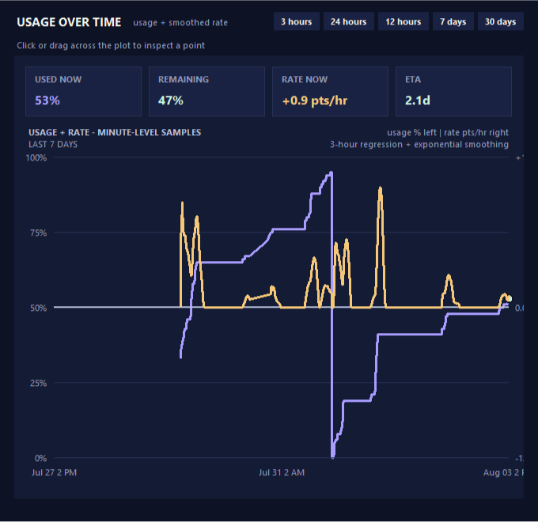

# Codex Usage Counter

A small Windows desktop counter that keeps your current Codex usage visible without opening a dashboard.

[Download the latest Windows release](../../releases/latest)

## What it does

- Shows the latest local Codex rate-limit percentage, usage window, plan, reset countdown, and signal state.
- Displays the current number directly in the notification-area tray icon, so it is readable without hovering.
- Shows a configurable app-icon-only milestone popup in the top-right corner.
- Polls local usage every two minutes by default; **Refresh now** reads immediately outside that schedule.
- Supports Used or Remaining display mode, always-on-top behavior, optional Start with Windows behavior, optional custom milestone chime, configurable polling, and configurable milestone size, trigger percentage, and duration.
- Keeps minute-level usage history with 3-hour, 12-hour, 24-hour, 7-day, and 30-day overlapping usage/rate graphs.
- Provides click-and-drag point inspection, smoothed rate trends, ETA, reset-aware regression, and time-series statistics.

## Quick start on Windows

1. Download `CodexUsageCounter.exe` from the [latest release](../../releases/latest).
2. Run it. The app starts in the notification area and opens its counter window.
3. Use **Settings** to choose Used or Remaining, enable or disable Start with Windows, and adjust polling or milestone behavior.
4. To start it with Windows, run `install-startup.ps1` from the downloaded package, or use the packaged app path when prompted.

The executable is self-contained and does not require Python to be installed.

## Screenshots

### Counter window



### Statistics view



## How the data is read

The counter reads the latest `rate_limits` event from JSONL files under:

```text
%USERPROFILE%\.codex\sessions
```

It does not read `auth.json`, API keys, cookies, browser profiles, or conversation content. The usage dashboard link opens the official dashboard for the authoritative view. Because the counter is based on local session telemetry, it can show a stale signal until a newer Codex event is written; **Refresh now** forces an immediate local read.

Closing the window hides it to the tray. Use the tray menu’s **Quit** command to exit.

## Run from source

```powershell
python .\codex_usage_counter.py
```

The source app uses Python’s built-in Tk interface and Windows APIs for the tray icon. It has no third-party runtime dependency.

## Build a standalone executable

From the project directory:

```powershell
python -m pip install pyinstaller
.\build.ps1
```

The build script regenerates the numeric tray icon set in `assets\taskbar` and creates `dist\CodexUsageCounter.exe` with PyInstaller.

## Start with Windows

After building, run:

```powershell
.\install-startup.ps1
```

Use `-Remove` to remove the current-user Startup shortcut.
